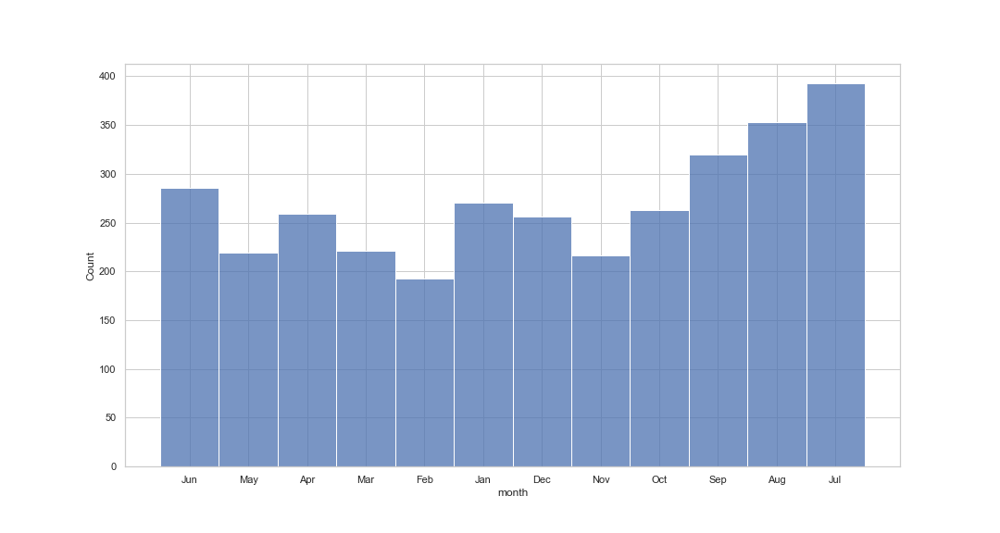
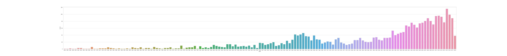
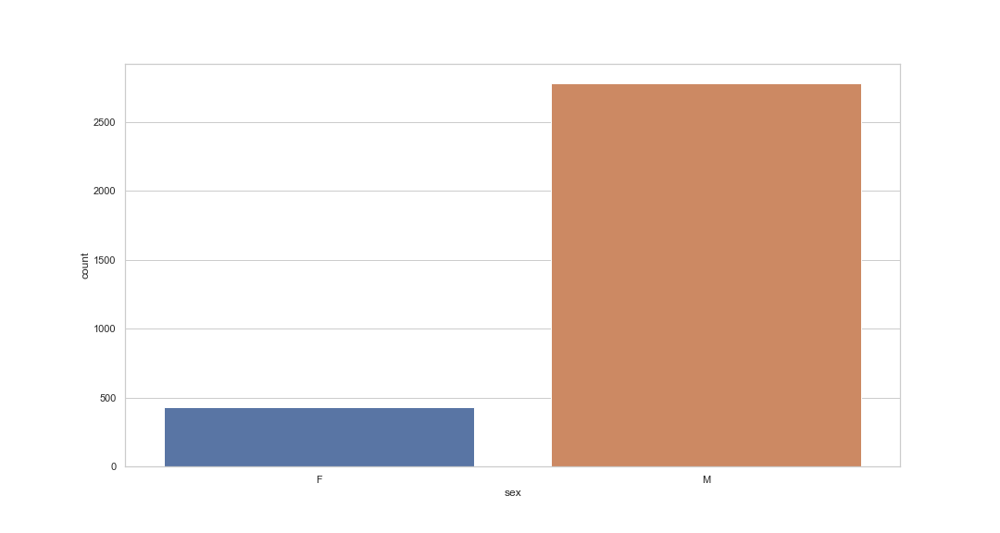

 # Shark attacks project {style=text-align:center}

 ## Exploring the general information

 There are 24 columns and 25723 rows.
### Missing values
Inspecting the amount of missing values, it is possible to note that their are massive. The column with less missing values is Case number (17021) and the column with more missing values are Unnamend: 22 and 23 (25722,25721). Those two columns missing values almost match the total sample and therefore they were retrieved from further analysis. Checking the  percentage of missing values, the average missing value is 77.19 (min= 66.17 (case attacks) and max=88.54)), suggesting that the majority of rows are empty. In that case, due to the type of data colection, missing data can be ignorable (likely to be completely at random) and the best treatment at this step is data deletion as features with more than 50% of missing data should not be analyzed. Deleting rows missing values having age as reference returns most roles with less than 10 % of missing values (with the exception of Time and Species), value that is recommended for further analysis. The updated dataset has 3471 cases and 22 columns.

### Standardizing columns
Further cleaning the dataset, the columns with information that do not contribute for further analysis were deleted. Those columns were Investigator or Source, pdf, href formula, href, original order, Case Number.1, Case Number.2, Case Number, Time and Name.
The updated dataset has 12 columns. Next, column names are standardized to be lower case and spaces are striped from the name.

## Exploring types and values of the variables
First thing was checking for duplicate values. There are none. Then, explring the variables types. All are objects with the exception of year. I also checked the first case. Next, cleaning and transforming the variables.

### Cleaning and initial plots per variable

#### Date
Exploring the data count and unique values it is possible to conclude that the data in this variable is not standardized and that there are not many entries per date registered. So, using regex I extracted month from the date and created a new variable 'month'. Therefore, this variable has more meaning and it will be further used in analysis. Here is the plot of the number or attacks per month. 

 
Analyzing the month graph it is possible to see that most attacks happen in July, August and September, suggesting that summer is the season with more attacks. However, as the dataset have countries from both hemispheres, this hypothesis has to be further investigated acccounting per hemisphere.

#### Year
The first step was to transform the type of the variable yeaer from float to integer.After that, ploting the distribution it is possible to see that cases started to be recorded more systematically from 1850 on.

 

Therefore, I considered year from 1850, on; with a distribution plotted with 20 bins looking like the following.
 

 

#### Sex
After cleaning invalid entries and striping spaces, the sample has 2806 men and 436 women.
 
I also created a dummy vatiable 'sex_count'having 'male'as 0 and 'female'as 1.

#### Age
Exploring the data count and unique values it is possible to conclude that the data in this variable is not standardized and that are some invalid entries. using regex I extract entries with 1 or 2 digits. Ploting the age distribution we notice that most victims are in their early 20s and a bit younger.
After cleaning invalid entries and striping spaces, the sample has 2806 men and 436 women. Distributing gender by age it is also possible to see that female victims are younger than male, that are mostly young adults.

## Hypothesis testing
During the exploratory analysis it was possible to hypothesize that summer is the season with more shark attacks. However, as there are countries from all over the world and seasons are not corresponding in the hemispheres, I have three hypotheses:
###H1: Overal, summer is the season woth more attacks reported.
###H2a: In both hemispheres, summer will be the season with more attacks
###H2b: In both hemispheres, winter will be the season with less attacks

The next step was to define a function assign corresponding countries to the North and South hemispheres. Next, using lambda, create a new variable hemisphere.
After that, I defined a function that assign the corresponding season consdering the emisphere and months. A new variable was created to store that information. Ploting the attacks per hemisphere it is possible to see that the North hemisphere has more attacks registered than the South one.

 

###Testing H1: 
Overal, summer is the season woth more attacks reported.
Ploting attacks per season, overall, it is possible to accept hypothesis 1 as summer is the one with most attack occurences.

 

###Testing H2a and 2b:
 In both hemispheres, summer was the season with more attacks, further confirming hypothesis 2a. By turn, winter is the season with less attacks, confirming hypothesis 2b.

 

